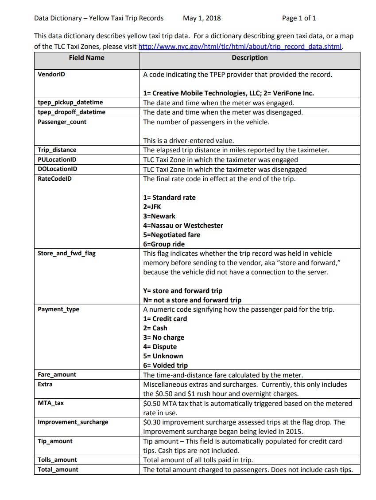

# Coding-Dojo-SQL-project

## Introduction:

This data provided by [The yellow and green taxi trip records](https://www1.nyc.gov/assets/tlc/downloads/pdf/data_dictionary_trip_records_yellow.pdf) include fields capturing pick-up and drop-off dates/times, pick-up and drop-off locations, trip distances, itemized fares, rate types, payment types, and driver-reported passenger counts. The data used in the attached datasets were collected and provided to the NYC Taxi and Limousine Commission (TLC) by technology providers authorized under the Taxicab & Livery Passenger Enhancement Programs (TPEP/LPEP).

In this project, we will apply what we've applied on advanced SQL lessons with AWS using **BlazingSql Jupyter**. We collected information from the dataset, we answered questions about Yellow Taxi Trip Records. Moreover, we visualized diversifying chart types. 

> **This project is a part of [Coding Dojo Data Science course](http://learn.codingdojo.com/m/196/6244/46875) under supervision of the [Saudi Digital Academy](https://sda.edu.sa/ar/hemam)**

# project Tools:
•``BlazingSql``: [BlazingSQL](https://docs.blazingdb.com/docs/blazingsql)is a SQL interface for cuDF, with various features to support large scale data science workflows and enterprise datasets.

•``S3 bucket``: We connect to [S3](https://www.youtube.com/watch?time_continue=9&v=_I14_sXHO8U&feature=emb_title) bucket , and creat taxi table from it.

•``matplotlib``: [Visualization tool.](https://matplotlib.org/)

# Describtion of Yellow Taxi Trip Records:

# Resources:
- https://docs.blazingdb.com/docs/blazingsql
- https://www.youtube.com/watch?time_continue=9&v=_I14_sXHO8U&feature=emb_title

# This project done by group members:
• [FARAH SIDINA](https://github.com/faro7ah)

• [HAILAH ALHARTHI](https://gist.github.com/helah20)

• [Rahaf Shiqdar](https://github.com/RahafSh)

• [Bedoor Alharbi](https://github.com/ibedoor)

